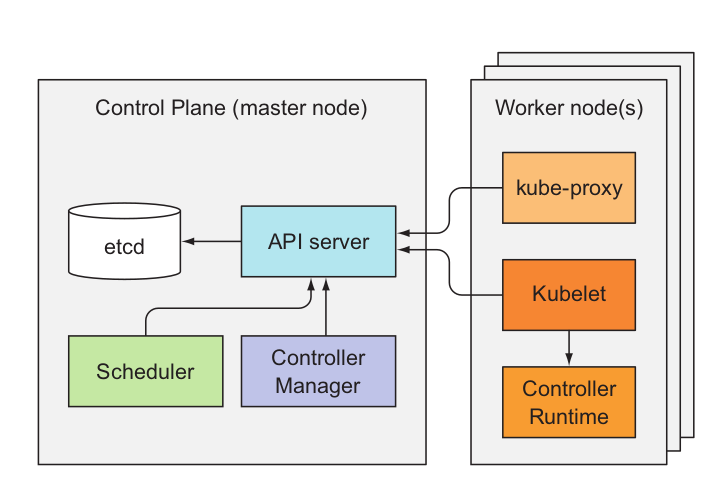
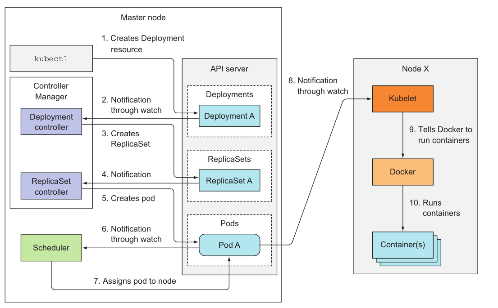

## Kubernetes Core Concepts

### Kubernetes Architecture

`Kubernetes` 는 아래와 같이 `master`와 `worker` **노드** 구조로 구성이 된다.
`master` 와 `worker` 노드는 다수가 존재할 수 있으며, *High Availability(HA)* 를 지원하기 위해 주로 multiple master,
 multiple worker node 기반으로 구성이 된다. `master`와 `worker`로 구성된 단위를 흔히 ***cluster*** 라고 표현한다.

여기서 **노드**는 실제 리소스 (예: pod)가 배포되는 "host" 환경이라고 생각할 수 있다.

그림에서 보이는 나머지 모듈/컴포넌트들은 ***'어떤 리소스가 어디에(노드)에 배포되고, 이 리소스가 어떻게 관리되는지'*** 를 지원하는 도구라고 볼 수 있다.



#### ETCD
`etcd` 는 오픈소스 기반에 key/value 저장소이며, 
단일 진실 공급원[single source of truth(SSOT)]으로서,
kubernetes에서 동작하고 있는 모든 리소스에 대한 정보 및 상태값을 저장하고 있다.
`etcd` 는 기본적으로 raft 방식으로 구성/동작한다.

#### kube-apiserver

`kube-apiserver` 는 인터페이스 역할을 담당하는 모듈로서,
사용자에 요청에 의해 리소스를 생성하거나 조회할 때 활용된다. 사용자는 주로 `kubectl`이라는 컨트롤러를 사용해서
이와 같은 요청을 `kube-apiserver`에게 전달하며, 클러스터를 구성하는 worker node 의 `kubelet` 을 통해 각 노드에 동작하고 있는 리소스에 대한
상태를 공유 받는다.

`kube-apiserver` 는 또한 `scheduler`와 `controller`와도 연계되며, 
실질적으로 전반적인 클러스터에 모든 정보를 앞서 설명된 `etcd`에 기재하는 중요한 역할을 담당한다.

#### scheduler
`scheduler` 는 요청받은 리소스를 효율적으로 worker node에 할당할 때 사용된다.
`scheduler` 는 노드에 배포되어 있는 pod, 노드의 HW/SW, 메모리와 CPU 활용량 등, 다수의 정보 기반으로 **어떤 프로세스를 어떤 노드에 배포할 지**를
관리하게 된다.

#### kube-controller-manager
`kube-controller-manager`는 다수의 controller로 구성되어 있으며, replica, service등이 어떻게 동작하고 구성되어 있는지를 관리한다.
- Node controller: Responsible for noticing and responding when nodes go down.
- Replication controller: Responsible for maintaining the correct number of pods for every replication controller object in the system.
- Endpoints controller: Populates the Endpoints object (that is, joins Services & Pods).
- Service Account & Token controllers: Create default accounts and API access tokens for new namespaces.

#### kubelet
`kubelet` 은 각 worker node에서 동작하고 있는 pod을 관리한다. 여기서 pod은,
`kubernetes`의 구성 유닛 중 제일 작은 단위라고 볼 수 있다. 


#### kube-proxy
`kube-proxy`는  노드의 네트워트 정책(rule)을 관리한다. `kube-proxy`는 cluster 내 각 노드에서 동작하며, kubernetes의 *service*와 연관되어
각 pod의 cluster 내/외 통신을 관리한다. 


#### container runtime
`container runtime`을 말그대로 컨네이터가 동작하는 방식/환경이다. 앞서 설명된 `kubelet`이 노드에 pod을 패보하게 되면,
해당 pod을 구성하는 container가 `container runtime`에 배포되는 샘이다. `docker engine`이 현재 제일 많이 활용되는 runtime 이다.




#### definition yaml template
```yaml
apiVersion: v1 #apiVersion 명시
kind: Pod #리소스 타입: Pod, ReplicaSet, Deployment, etc.
metadata: # name, label등 리소스에 대한 meta값
    ...
spec: #리소스에 대한 specification 정의. 어떤 kind인지에 따라 해당 내용이 많이 바뀐다.
    ...
```
