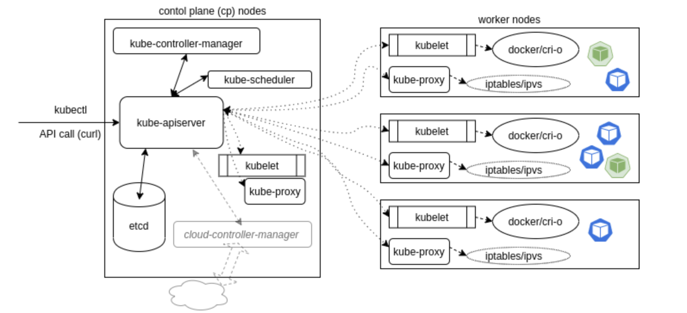

#  Kubernetes Core Concepts

## Key Concepts of Kubernetes

- Interesting fact: k8s is pronounced **Kate's**.
- `microservices` and `transience` (일시적인 / 순간적인)
- 쿠버에 따라서 프로그램을 재설계할 필요가 있을 수도 있다!

##  Kubernetes Architecture

`Kubernetes` 는 아래와 같이 `master`(혹은 `control plane`)와 `worker` **노드** 구조로 구성이 된다.
`master` 와 `worker` 노드는 다수가 존재할 수 있으며, *High Availability(HA)* 를 지원하기 위해 주로 multiple master,
 multiple worker node 기반으로 구성이 된다. `master`와 `worker`로 구성된 단위를 흔히 ***cluster*** 라고 표현한다.

여기서 **노드**는 실제 리소스 (예: pod)가 배포되는 "host" 환경이라고 생각할 수 있다.

그림에서 보이는 나머지 모듈/컴포넌트들은 ***'어떤 리소스가 어디에(노드)에 배포되고, 이 리소스가 어떻게 관리되는지'*** 를 지원하는 도구라고 볼 수 있다.



### Control Plane Node

`cp` node 즉, 마스터 노드에는 아래와 같은 component가 설치되어 있다.
- `etcd`
- `kube-apiserver`
- `kube-controller`
- `scheduler`

#### ETCD

`etcd` 는 오픈소스 기반에 key/value 저장소이며, 
단일 진실 공급원[single source of truth(SSOT)]으로서,
kubernetes에서 동작하고 있는 모든 리소스에 대한 정보 및 상태값을 저장하고 있다.
`etcd` 는 기본적으로 raft 방식으로 구성/동작한다.

####  kube-apiserver

`kube-apiserver` 는 인터페이스 역할을 담당하는 모듈로서,
사용자에 요청에 의해 리소스를 생성하거나 조회할 때 활용된다. 사용자는 주로 `kubectl`이라는 컨트롤러를 사용해서
이와 같은 요청을 `kube-apiserver`에게 전달하며, 클러스터를 구성하는 worker node 의 `kubelet` 을 통해 각 노드에 동작하고 있는 리소스에 대한
상태를 공유 받는다.

`kube-apiserver` 는 또한 `scheduler`와 `controller`와도 연계되며, 
실질적으로 전반적인 클러스터에 **모든 정보를 앞서 설명된 `etcd`에 기재하는 중요한 역할을 담당한다.**

유일하게 `etcd` 와 통신하는 모듈이기도 하다. 

####  scheduler
`scheduler` 는 요청받은 리소스를 효율적으로 `worker node`에 할당할 때 사용된다. (알고리즘을 활용?)
`scheduler` 는 노드에 배포되어 있는 pod, 노드의 HW/SW, 메모리와 CPU 활용량 등, 다수의 정보 기반으로 **어떤 프로세스를 어떤 노드에 배포할 지**를
관리하게 된다.

####  kube-controller-manager
`kube-controller-manager`는 다수의 controller로 구성되어 있으며, replica, service등이 어떻게 동작하고 구성되어 있는지를 관리한다.
- Node controller: Responsible for noticing and responding when nodes go down.
- Replication controller: Responsible for maintaining the correct number of pods for every replication controller object in the system.
- Endpoints controller: Populates the Endpoints object (that is, joins Services & Pods).
- Service Account & Token controllers: Create default accounts and API access tokens for new namespaces.

####  cloud-controller-manager?
This is something new I think..


###  All Nodes

모든 노드에는 아래 `component` 가 설치된다.

####  kubelet
`kubelet`(systemd 프로세스) 은 각 `worker node`에서 동작하고 있는 pod을 관리한다. (`master node` 안에서도 `kubelet` 이 동작하고 있다) 여기서 pod은,
`kubernetes`의 구성 유닛 중 제일 작은 단위라고 볼 수 있다. 

세부사항
- `PodSpec` 을 사용한다.
- `Pod`의 볼륨을 마운트 한다.
-  secrets 을 받는다.
- local container engine (`docker`, `cri-o`) 로 여ㅛ청사항을 전달한다.
- `pod`과`node` 상황을 클러스터 공유한다. 


####  kube-proxy
`kube-proxy`는  노드의 네트워트 정책(rule)을 관리한다. `kube-proxy`는 cluster 내 각 노드에서 동작하며, kubernetes의 *service*와 연관되어
각 pod의 cluster 내/외 통신을 관리한다. 


#### container runtime
`container runtime`을 말그대로 컨네이터가 동작하는 방식/환경이다. 앞서 설명된 `kubelet`이 노드에 pod을 패보하게 되면,
해당 pod을 구성하는 container가 `container runtime`에 배포되는 샘이다. `docker engine`이 현재 제일 많이 활용되는 runtime 이다.

#### network-realated daemonsets

`worker node`에 기동하고 있는 `pod` 타 워커노드 및 `cp` 노드에서 동작하고 있는 리소스와 통신할 수 있도록,
각 워커노드에는 네트워크를 담당하는 daemonset이 동작하고 있다.


### Kubernetes Deployment

앞서 언급한 바와 같이 `kubernetes`에서는 Pod 이 제일 작은 단위 유닛이라고 볼 수 있으며,
이런 단일 혹은 다수의 Pod을 ***배포(deploy)*** 하는 방식으로 시스템을 구현하게 된다.

추가적으로 하나의 pod 은 여러게의 container로 구성될 수가 있다.
같은 pod에 있는 container들은 같은 network namespace를 사용한다. (IP 도 공유한다. 이 컨셉이 single ip per pod)
volumemount는 다르다. 고로 동일한 볼륨을 바라보기 위해서는 container마다 volume을 설정해 줄 필요가 있다.

### Services

`service` 는 `endpoint` operator를 참조하여 어떤 pod에 대한 접근 설정이 필요한지 설정해준다. `service` 의 주혁할은:
- `pod` 간 연계 
- `pod`을 외부 환경으로 노출
- `pod`에 대한 `access policy` 정의

서비스는 `clusterIP`, `nodePort`, `LoadBalancer` 로 구분된다.  

#### Pod 조회 방법
```shell script
# get pods 실행 시 default namespace에 있는 리소스를 조회한다.
master $ kubectl get pods
No resources found in default namespace.

# -A, option 활용 시 모든 namespace 리소스에 대한 리소스가 조회된다.
master $ kubectl get pods -A
NAMESPACE     NAME                             READY   STATUS              RESTARTS   AGE
kube-system   coredns-5644d7b6d9-b6nv4         1/1     Running             0          3m9s
kube-system   coredns-5644d7b6d9-rts69         1/1     Running             0          3m9s
kube-system   etcd-master                      1/1     Running             0          2m58s
kube-system   kube-apiserver-master            1/1     Running             0          3m10s
kube-system   kube-controller-manager-master   1/1     Running             0          3m
kube-system   kube-proxy-5kg5r                 1/1     Running             0          3m9s
kube-system   kube-proxy-q5ngv                 1/1     Running             0          2m49s
kube-system   kube-scheduler-master            1/1     Running             0          3m14s
kube-system   weave-net-7zcb9                  2/2     Running             1          3m9s
kube-system   weave-net-vxq7w                  2/2     Running             1          2m49s


# kubectl describe command를 활용하면, 리소스에 대한 부가 정보를 볼 수 있다.
master $ kubectl -n kube-system describe pod weave-net-7zcb9  
Name:         weave-net-7zcb9Namespace:    kube-system
Priority:     0
Node:         master/172.17.0.27
Start Time:   Sun, 10 May 2020 15:00:41 +0000
Labels:       controller-revision-hash=7f54576664
              name=weave-net
              pod-template-generation=1
Annotations:  <none>
Status:       RunningIP:           172.17.0.27
IPs:  IP:           172.17.0.27
Controlled By:  DaemonSet/weave-net
Containers:
  weave:
    Container ID:  docker://5fd02506cf6e86be5f49df33894107e1bde3a1232fafedb34092d89e2af33107
    Image:         docker.io/weaveworks/weave-kube:2.6.0    Image ID:      docker-pullable://weaveworks/weave-kube@sha256:e4a3a5b9bf605a7ff5ad5473c7493d7e30cbd1ed14c9c2630a4e409b4dbfab1c
    Port:          <none>
    Host Port:     <none>
    Command:
      /home/weave/launch.sh
    State:          Running
      Started:      Sun, 10 May 2020 15:01:16 +0000
    Last State:     Terminated
      Reason:       Error
      Exit Code:    1
      Started:      Sun, 10 May 2020 15:00:43 +0000
      Finished:     Sun, 10 May 2020 15:01:14 +0000
    Ready:          True
    Restart Count:  1
    Requests:
      cpu:      10m
    Readiness:  http-get http://127.0.0.1:6784/status delay=0s timeout=1s period=10s #success=1 #failure=3
    Environment:
      HOSTNAME:   (v1:spec.nodeName)
    Mounts:
      /host/etc from cni-conf (rw)
      /host/home from cni-bin2 (rw)
      /host/opt from cni-bin (rw)
      /host/var/lib/dbus from dbus (rw)
      /lib/modules from lib-modules (rw)
      /run/xtables.lock from xtables-lock (rw)
      /var/run/secrets/kubernetes.io/serviceaccount from weave-net-token-v8dx6 (ro)
      /weavedb from weavedb (rw)
  weave-npc:
    Container ID:   docker://125ba582ec86293451e1af3e340fb7a193077a972a764e9e905a882c667e12d4
    Image:          docker.io/weaveworks/weave-npc:2.6.0
    Image ID:       docker-pullable://weaveworks/weave-npc@sha256:985de9ff201677a85ce78703c515466fe45c9c73da6ee21821e89d902c21daf8
    Port:           <none>
    Host Port:      <none>
    State:          Running
      Started:      Sun, 10 May 2020 15:00:44 +0000
    Ready:          True
    Restart Count:  0
    Requests:
      cpu:  10m
    Environment:
      HOSTNAME:   (v1:spec.nodeName)
    Mounts:
      /run/xtables.lock from xtables-lock (rw)
      /var/run/secrets/kubernetes.io/serviceaccount from weave-net-token-v8dx6 (ro)
Conditions:
  Type              Status
  Initialized       True
  Ready             True
  ContainersReady   True
  PodScheduled      True
Volumes:
  weavedb:
    Type:          HostPath (bare host directory volume)
    Path:          /var/lib/weave
    HostPathType:
  cni-bin:
    Type:          HostPath (bare host directory volume)
    Path:          /opt
    HostPathType:
  cni-bin2:
    Type:          HostPath (bare host directory volume)
    Path:          /home
    HostPathType:
  cni-conf:
    Type:          HostPath (bare host directory volume)
    Path:          /etc
    HostPathType:
  dbus:
    Type:          HostPath (bare host directory volume)
    Path:          /var/lib/dbus
    HostPathType:
  lib-modules:
    Type:          HostPath (bare host directory volume)
    Path:          /lib/modules
    HostPathType:
  xtables-lock:
    Type:          HostPath (bare host directory volume)
    Path:          /run/xtables.lock
    HostPathType:  FileOrCreate
  weave-net-token-v8dx6:
    Type:        Secret (a volume populated by a Secret)
    SecretName:  weave-net-token-v8dx6
    Optional:    false
QoS Class:       Burstable
Node-Selectors:  <none>
Tolerations:     :NoSchedule
                 node.kubernetes.io/disk-pressure:NoSchedule
                 node.kubernetes.io/memory-pressure:NoSchedule
                 node.kubernetes.io/network-unavailable:NoSchedule
                 node.kubernetes.io/not-ready:NoExecute
                 node.kubernetes.io/pid-pressure:NoSchedule
                 node.kubernetes.io/unreachable:NoExecute
                 node.kubernetes.io/unschedulable:NoSchedule
Events:
  Type     Reason     Age                    From               Message
  ----     ------     ----                   ----               -------
  Normal   Scheduled  <unknown>              default-scheduler  Successfully assigned kube-system/weave-net-7zcb9 to master
  Normal   Pulled     6m38s                  kubelet, master    Container image "docker.io/weaveworks/weave-npc:2.6.0" already present on machine
  Normal   Created    6m38s                  kubelet, master    Created container weave-npc
  Normal   Started    6m37s                  kubelet, master    Started container weave-npc
  Warning  Unhealthy  6m11s (x3 over 6m31s)  kubelet, master    Readiness probe failed: Get http://127.0.0.1:6784/status: dial tcp 127.0.0.1:6784: connect: connection refused
  Normal   Created    6m6s (x2 over 6m39s)   kubelet, master    Created container weave
  Normal   Pulled     6m6s (x2 over 6m39s)   kubelet, master    Container image "docker.io/weaveworks/weave-kube:2.6.0" already present on machine
  Normal   Started    6m5s (x2 over 6m38s)   kubelet, master    Started container weave
```


### Kubernetes Sequence Diagram

`kubernetes``의 컨샙 및 전반적인 구성을 조금 더 쉽게 이해하기 위해,
아래 sequence diagram 을 통해 리소스가 배포되는 흐름을 살펴본다.


#### Replicaset 생성 Flow Diagram

1. `kubectl`로 `kube-apiserver`로 리소스(replicaset) 배포 요청
2. `etcd` 로 현재 상태 조회 및 사용자에 대한 `authentication` 수행 `RBAC`.
3. `kube-apiserver` 상 `deployment` 생성. `etcd`에 정보 기재
4. `apiserver`를 바라보고 있는 `deployment controller`가 해당 리소스 정보 기반으로 `replicaset`정보 생성
5. `apiserver`를 바라보고 있는 `replicaset controller`에서 관련 `pod` (x N) 생성
6. `apiserver`를 바라보고 있는 `scheduler` 가 `pod`을 노드에게 할당 및 각 노드에 `kubelet`에게 전달
7.  `kubelet` 은 `container runtime (docker)`  에게 `pod`에 해당하는 `container` 생성 지시
8. `container` 생성

### Kubernetes Namespace

`kubernetes`에서 `namespace` 는 배포되는 리소스를 구분하기 위한 방법이다. 필요 시 `namespace` 마다 권한도 지정할 수 있다.

namespace를 조회하기 위핸 `kubectl get namespace` command를 활용한다.
```shell script
# ns 약자 사용가능
kubectl get ns

# kube-system namespace 조회
master $ kubectl get ns kube-system
NAME          STATUS   AGE
kube-system   Active   81s
 

# -A 로 pod을 조회했을때 각 pod이 속한 namespace가 확인 가능
master $ kubectl get po -A
NAMESPACE     NAME                             READY   STATUS    RESTARTS   AGE
default       ubuntu-sleeper                   1/1     Running   0          18m
default       ubuntu-sleeper-2                 1/1     Running   0          10m
default       ubuntu-sleeper-3                 1/1     Running   0          2m51s
kube-system   coredns-5644d7b6d9-mnfkm         1/1     Running   0          18m
kube-system   coredns-5644d7b6d9-nn4rn         1/1     Running   0          18m
kube-system   etcd-master                      1/1     Running   0          19m
kube-system   kube-apiserver-master            1/1     Running   1          18m
kube-system   kube-controller-manager-master   1/1     Running   0          18m
kube-system   kube-proxy-c5rnd                 1/1     Running   0          18m
kube-system   kube-proxy-k76tk                 1/1     Running   0          18m
kube-system   kube-scheduler-master            1/1     Running   0          19m
kube-system   weave-net-2d9pz                  2/2     Running   0          18m
kube-system   weave-net-jk2rz                  2/2     Running   0          18m
```

#### definition yaml template
```yaml
apiVersion: v1 #apiVersion 명시
kind: Pod #리소스 타입: Pod, ReplicaSet, Deployment, etc.
metadata: # name, label등 리소스에 대한 meta값
    ...
spec: #리소스에 대한 specification 정의. 어떤 kind인지에 따라 해당 내용이 많이 바뀐다.
    ...
```

#### 간단한 리소스 생성 방법
`kubectl create` 로 리소스를 간단하게 생성할 수 있다.