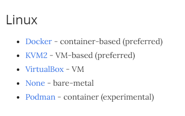

# Minikube start

`minikube` is an open source tool that can be used to launch a "mini kubernetes" cluster for self-study and small tests.
For more information on `minikube`, please refer to the [official minikube documentation](https://minikube.sigs.k8s.io/docs/)
Because minikube is a cross platform tool, it can be installed on Windows, Linux, and Mac, and can be deployed as a VM,
a container, or on bare-metal.

This documentation will explore the docker implementation of `minikube`

### prerequisite
For the exercise, you will need the following:
- 2 CPUs or more
- 2GB of free memory
- 20GB of free disk space
- Internet connection
- Container or virtual machine manager, such as: Docker, ~~Hyperkit, Hyper-V, KVM, Parallels, Podman, VirtualBox, or VMWare~~

For this exercise, I used an `ubuntu 20.04 LTS` running on Virtualbox VM within windows, so ese
As we are using `docker` as the driver for `minikube` we only need to download `docker`.

### install docker

```shell
sudo apt install docker.io

$ docker version

Client:
 Version:           19.03.8
 API version:       1.40
 Go version:        go1.13.8
 Git commit:        afacb8b7f0
 Built:             Wed Oct 14 19:43:43 2020
 OS/Arch:           linux/amd64
 Experimental:      false

Server:
 Engine:
  Version:          19.03.8
  API version:      1.40 (minimum version 1.12)
  Go version:       go1.13.8
  Git commit:       afacb8b7f0
  Built:            Wed Oct 14 16:41:21 2020
  OS/Arch:          linux/amd64
  Experimental:     false
 containerd:
  Version:          1.3.3-0ubuntu2
  GitCommit:
 runc:
  Version:          spec: 1.0.1-dev
  GitCommit:
 docker-init:
  Version:          0.18.0
  GitCommit:

```


### Install minikube

To install `minikube` download the binary from the official website and move it to
*/usr/local/bin/*.

```shell
curl -LO https://storage.googleapis.com/minikube/releases/latest/minikube-linux-amd64
sudo install minikube-linux-amd64 /usr/local/bin/minikube
```
As explained earlier, there are multiple driver options for `minikube`, but because `Docker` or
`KVM2` is the preferred method, we will install using `docker` as the driver option.



```shell
minikube start --driver=docker

 minikube v1.16.0 on Ubuntu 20.04 (vbox/amd64)
* Using the docker driver based on user configuration
* Starting control plane node minikube in cluster minikube
* Pulling base image ...
* Downloading Kubernetes v1.20.0 preload ...
    > preloaded-images-k8s-v8-v1....: 491.00 MiB / 491.00 MiB  100.00% 32.67 Mi
* Creating docker container (CPUs=2, Memory=2200MB) ...
* Preparing Kubernetes v1.20.0 on Docker 20.10.0 ...
  - Generating certificates and keys ...
  - Booting up control plane ...
...

```

samsonites@samsonites-ubuntu-vm:~$ minikube status
minikube
type: Control Plane
host: Running
kubelet: Running
apiserver: Running
kubeconfig: Configured
timeToStop: Nonexistent

samsonites@samsonites-ubuntu-vm:~$

```

https://kubernetes.io/docs/tasks/tools/install-kubectl/
